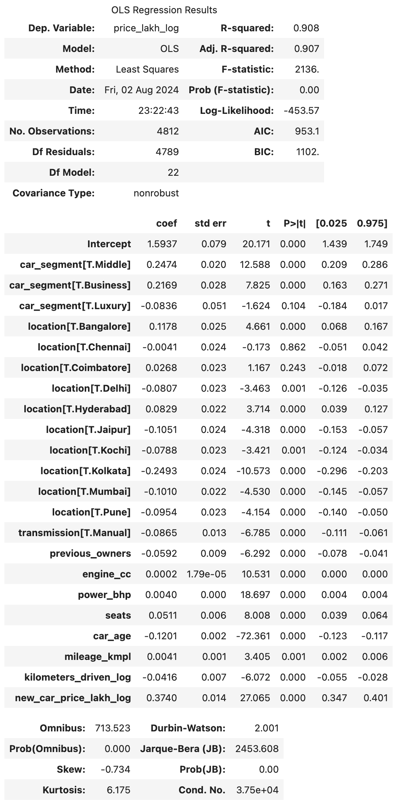
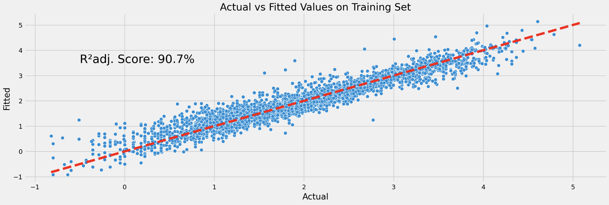
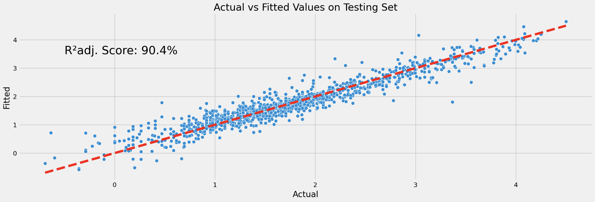
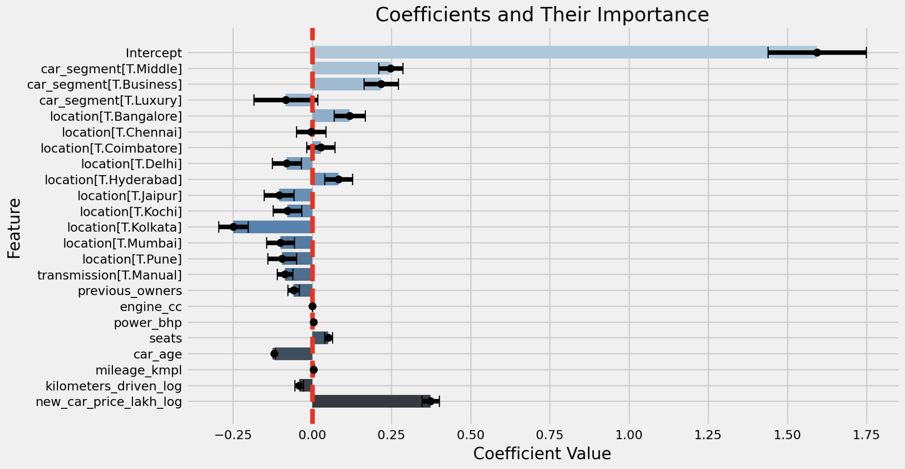

# Project Overview

## Introduction

The Car4u project aimed to build a predictive model for estimating the price of used cars based on various features. This project involved analyzing historical data to identify key factors influencing car prices and developing models to predict these prices accurately.

- **Project Goal:**
  - Conduct exploratory data analysis on the Cars4u dataset, which contains information about used cars sold in India.
  - Explore the data, assess its quality, and prepare it for predictive analysis.
  - Predict the price of used cars based on features such as location, brand, and technical specifications.

- **Key Findings:**
  - The model predicts prices with high accuracy.
  - Significant factors influencing price include car segment, location, engine size, number of seats, car age, mileage, kilometers driven, transmission type, and new car price.

- **Recommendations:**
  - Utilize the model to set competitive pricing strategies and make informed decisions regarding car inventory.

## Methodology

The project was divided into the following phases:

1. **Initial Data Exploration:**
   - Import the dataset from a CSV file.
   - Identify and assess missing values.
   - Explore data structure and basic statistics.

2. **Data Cleaning:**
   - Handle missing values and inconsistencies.
   - Convert relevant columns to appropriate data types.
   - Remove duplicate records.

3. **Exploratory Data Analysis (EDA):**
   - Visualize the distribution of each feature.
   - Identify correlations between features and the target variable.
   - Summarize key statistics of the dataset.
   - Detect and address outliers.

4. **Feature Engineering:**
   - Create new features and encode categorical variables.
   - Normalize/standardize data and apply necessary transformations.

5. **Model Building:**
   - Split the dataset into training and testing sets (80/20) for evaluation.
   - Train various regression models to predict car prices.
   - Evaluate model performance using metrics such as Mean Squared Error (MSE), R-squared, etc.
   - Select the best-performing model based on evaluation metrics.
   - Validate the model's predictions against actual prices and use it to predict used car prices.

## Assumptions

- **Data Quality:** The dataset is assumed to be accurate and representative of the used car market. Any inconsistencies or errors in the data are addressed during the cleaning process.
- **Feature Relevance:** Features such as age, mileage, fuel type, and engine capacity are assumed to be relevant predictors of used car prices.
- **Linearity:** Initial modeling assumes a linear relationship between predictors and car prices.
- **Independence:** Observations in the dataset are assumed to be independent.

## Scope

- **Objective:** Build a predictive model that accurately estimates used car prices based on various features.
- **Data:** The dataset includes information such as model, location, year of manufacture, mileage, fuel type, transmission, engine capacity, power, number of seats, and price.
- **Analysis:** Focus on understanding the relationship between features and car prices, identifying significant predictors, and building a robust prediction model.
- **Modeling:** Explore different regression models and select the best based on performance metrics.
- **Deliverables:** A predictive model and a comprehensive report detailing analysis and findings.

# Data Collection and Preparation

The dataset is downloaded from Kaggle (https://www.kaggle.com/datasets/sukhmanibedi/cars4u). It was cleaned and prepared to ensure accuracy and reliability.

## Data Description

The dataset is a CSV file containing information about used cars. It includes 7253 rows and 14 columns.

| Attribute         | Data Type | Description                                                      |
|:------------------|:----------|:-----------------------------------------------------------------|
| S.No.             | Integer   | A unique identifier for each data point in the dataset.          |
| Name              | String    | The brand and model name of the used car.                        |
| Location          | String    | The city or location where the car is being sold.                |
| Year              | Integer   | The year the car was manufactured.                               |
| Kilometers_Driven | Integer   | The total distance the car has been driven, measured in kilometers. |
| Fuel_Type         | String    | The type of fuel the car uses, such as Petrol, Diesel, CNG, etc. |
| Transmission      | String    | The type of transmission in the car, such as Manual or Automatic. |
| Owner_Type        | String    | The ownership status of the car, such as First Owner, Second Owner, etc. |
| Mileage           | String    | The fuel efficiency of the car, typically measured in kilometers per liter (km/l) or miles per gallon (mpg). |
| Engine            | String    | The displacement of the car's engine, typically measured in cubic centimeters (cc). |
| Power             | String    | The power output of the car's engine, typically measured in horsepower (BHP). |
| Seats             | Decimal   | The total number of seats in the car.                            |
| New_Price         | String    | The original price of the car when it was new.                   |
| Price             | Decimal   | The current selling price of the used car.                       |

# Comprehensive Analysis

## Data Cleaning

### Missing Values

The initial data overview revealed missing values in the Mileage, Engine, Power, Seats, New_Price, and Price columns.

| Column            | Missing Values | Processing Strategy                                             |
|:------------------|:---------------|:----------------------------------------------------------------|
| S.No.             | 0%        | Drop the column                                                  |
| Name              | 0%        | Split into Brand and Model; convert to categorical type          |
| Location          | 0%        | Convert to categorical type                                      |
| Year              | 0%        | Convert to categorical type                                      |
| Kilometers_Driven | 0%        | No missing values                                               |
| Fuel_Type         | 0%        | Convert to categorical type                                      |
| Transmission      | 0%        | Convert to categorical type                                      |
| Owner_Type        | 0%        | Convert to categorical type                                      |
| Mileage           | 0.02%     | Transform to common unit (kmpl) and impute missing values        |
| Engine            | 0.6%      | Convert to decimal and impute missing values                     |
| Power             | 0.6%      | Convert to decimal and impute missing values                     |
| Seats             | 0.73%     | Impute missing values                                            |
| New_Price         | 86%       | Use multiple linear regression to impute missing values; cluster cars into segments using k-modes |
| Price             | 17%       | Use multiple linear regression to impute missing values          |

Missing values were addressed, outliers detected and managed, and categorical variables encoded appropriately.

### Duplicated Data

No duplicate rows were found in the dataset.

## Exploratory Data Analysis (EDA)

EDA provided insights into data distribution and relationships between variables.

- **Descriptive Statistics:** Summarized key features to reveal trends and distributions.
- **Visualizations:** Histograms, scatter plots, and correlation matrices were used to understand feature relationships and identify patterns.
- **Key Insights:** Strong correlations were found between car segment, location, and technical specifications with car prices.

## Model Building

Various modeling techniques were employed to predict car prices, including linear regression.

- **Model Selection:** Linear regression was chosen for its interpretability and performance.
- **Feature Engineering:** Features were selected based on their impact on car prices. Log transformations were applied to stabilize variance.
- **Model Training:** Models were trained using hold-out validation to avoid overfitting.

## Model Evaluation

The model was evaluated using various metrics on both training and testing datasets.

### Metrics

| Metric                                             | Training Set | Testing Set |
|:---------------------------------------------------|-------------:|------------:|
| Sum of Squared Errors (SSE)                        | 340.1914   |   85.4336 |
| Mean Absolute Error (MAE)                          |   1.2140   |    1.2153 |
| Mean Squared Error (MSE)                           |   1.0733   |    1.0735 |
| Root Mean Squared Error (RMSE)                     |   1.0360   |    1.0361 |
| Symmetric Mean Absolute Percentage Error (SMAPE)   |    15.9%   |    16.8% |
| R^2                                                |   0.9075   |    0.9061 |
| Adjusted R^2                                       |   0.9071   |    0.9044 |
| AIC                                                | 953.15     |   N/A |
| BIC                                                | 1102.16    |   N/A |

### Model Interpretation

The model performs well on both training and testing sets, with similar error metrics and R² values.

1. Approximately __91__% of variance of used car price explained by the predictors in the model.
2. Approximately __1.21 Lakh__ is average prediction error.
3. The model predicts incorrectly in approximately __16__% of all observations.
4. The intercept of __1.5937__, when the dependent variable is log-transformed, indicates that the expected price of a used car in the __Economy__ segment with __Automatic__ transmission and located in __Ahmedabad__ is approximately __4.92 Lakh__ ($\exp^{1.5937} = 4.92$, or __4.92 Lakh__), assuming all other predictors are zero. However, this situation is logically unrealistic because having all other predictors equal to zero is not a meaningful scenario in practice.
5. **Numerical Predictors Effect:**
   - **Previous Owners:** An increase in the number of previous owners by 1 is associated with a decrease in the price of the used car by approximately __5.74__% ($\exp^{-0.0592} - 1 = -0.0574$, or __-5.74__%), assuming all other predictors remain constant.\
     The predictor `previous_owners` is statistically significant (p-value = 0.0000).
   - **Engine CC:** An increase in engine CC by 1 unit is associated with an increase in the price of the used car by approximately __0.02__% ($\exp^{0.0002} - 1 = 0.0002$, or __0.02__%), assuming all other predictors remain constant.\
     The predictor `engine_cc` is statistically significant (p-value = 0.0000).
   - **Power BHP:** An increase in power bhp by 1 unit is associated with an increase in the price of the used car by approximately __0.40__% ($\exp^{0.0040} - 1 = 0.0040$, or __0.40__%), assuming all other predictors remain constant.\
     The predictor `power_bhp` is statistically significant (p-value = 0.0000).
   - **Seats:** An increase in the number of seats by 1 is associated with an increase in the price of the used car by approximately __5.25__% ($\exp^{0.0511} - 1 = 0.0525$, or __5.25__%), assuming all other predictors remain constant.\
     The predictor `seats` is statistically significant (p-value = 0.0000).
   - **Car Age:** An increase in car age by 1 year is associated with a decrease in the price of the used car by approximately __11.32__% ($\exp^{-0.1201} - 1 = -0.1132$, or __-11.32__%), assuming all other predictors remain constant. \
     The predictor `car_age` is statistically significant (p-value = 0.0000).
   - **Mileage (kmpl):** An increase in mileage by 1 kmpl is associated with an increase in the price of the used car by approximately __0.41__% ($\exp^{0.0041} - 1 = 0.0041$, or __0.41__%), assuming all other predictors remain constant.\
     The predictor `mileage_kmpl` is statistically significant (p-value = 0.0007).
   - **Kilometers Driven (Log):** An increase in kilometers driven by 1% is associated with a decrease in the price of the used car by approximately __0.04__%, assuming all other predictors remain constant.\
     The predictor `kilometers_driven_log` is statistically significant (p-value = 0.0000).
   - **New Car Price (Log):** An increase in the new car price by 1% is associated with an increase in the price of the used car by approximately __0.37__%, assuming all other predictors remain constant.\
     The predictor `new_car_price_lakh_log` is statistically significant (p-value = 0.0000).
6. **Transmission Effect:**
   - **Manual:** Moving from __Automatic__ to __Manual__ transmission, the price of a used car is expected to decrease by approximately __8.29__% ($\exp^{-0.0865} - 1 = -0.0829$, or __-8.29__%), assuming all other predictors remain constant.\
     The predictor `transmission[T.Manual]` is statistically significant (p-value = 0.0000).
7. **Location Effects:**
   - **Bangalore:** Moving from __Ahmedabad__ to __Bangalore__, the price of a used car is expected to increase by approximately __12.51__% ($\exp^{0.1178} - 1 = 0.1251$, or __12.51__%), assuming all other predictors remain constant.\
     The predictor `location[T.Bangalore]` is statistically significant (p-value = 0.0000).
   - **Chennai:** Moving from __Ahmedabad__ to __Chennai__, the price of a used car is expected to decrease by approximately __0.41__% ($\exp^{-0.0041} - 1 = -0.0041$, or __-0.41__%), assuming all other predictors remain constant.\
     The predictor `location[T.Chennai]` is statistically insignificant (p-value = 0.8624).
   - **Coimbatore:** Moving from __Ahmedabad__ to __Coimbatore__, the price of a used car is expected to increase by approximately __2.71__% ($\exp^{0.0268} - 1 = 0.0271$, or __2.71__%), assuming all other predictors remain constant.\
     The predictor `location[T.Coimbatore]` is statistically insignificant (p-value = 0.2433).
   - **Delhi:** Moving from __Ahmedabad__ to __Delhi__, the price of a used car is expected to decrease by approximately __7.75__% ($\exp^{-0.0807} - 1 = -0.0775$, or __-7.75__%), assuming all other predictors remain constant.\
     The predictor `location[T.Delhi]` is statistically significant (p-value = 0.0005).
   - **Hyderabad:** Moving from __Ahmedabad__ to __Hyderabad__, the price of a used car is expected to increase by approximately __8.64__% ($\exp^{0.0829} - 1 = 0.0864$, or __8.64__%), assuming all other predictors remain constant.\
     The predictor `location[T.Hyderabad]` is statistically significant (p-value = 0.0002).
   - **Jaipur:** Moving from __Ahmedabad__ to __Jaipur__, the price of a used car is expected to decrease by approximately __9.98__% ($\exp^{-0.1051} - 1 = -0.0998$, or __-9.98__%), assuming all other predictors remain constant.\
     The predictor `location[T.Jaipur]` is statistically significant (p-value = 0.0000).
   - **Kochi:** Moving from __Ahmedabad__ to __Kochi__, the price of a used car is expected to decrease by approximately __7.58__% ($\exp^{-0.0788} - 1 = -0.0758$, or __-7.58__%), assuming all other predictors remain constant.\
     The predictor `location[T.Kochi]` is statistically significant (p-value = 0.0006).
   - **Kolkata:** Moving from __Ahmedabad__ to __Kolkata__, the price of a used car is expected to decrease by approximately __22.07__% ($\exp^{-0.2493} - 1 = -0.2207$, or __-22.07__%), assuming all other predictors remain constant.\
     The predictor `location[T.Kolkata]` is statistically significant (p-value = 0.0000).
   - **Mumbai:** Moving from __Ahmedabad__ to __Mumbai__, the price of a used car is expected to decrease by approximately __9.61__% ($\exp^{-0.1010} - 1 = -0.0961$, or __-9.61__%), assuming all other predictors remain constant.\
     The predictor `location[T.Mumbai]` is statistically significant (p-value = 0.0000).
   - **Pune:** Moving from __Ahmedabad__ to __Pune__, the price of a used car is expected to decrease by approximately __9.10__% ($\exp^{-0.0954} - 1 = -0.0910$, or __-9.10__%), assuming all other predictors remain constant.\
     The predictor `location[T.Pune]` is statistically significant (p-value = 0.0000).
8. **Car Segment Effects:**
   - **Middle:** Moving from the __Economy__ segment to the __Middle__ segment, the price of a used car is expected to increase by approximately __28.07__% ($\exp^{0.2474} - 1 = 0.2807$, or __28.07__%), assuming all other predictors remain constant.\
     The predictor `car_segment[T.Middle]` is statistically significant (p-value = 0.0000).
   - **Business:** Moving from the __Economy__ segment to the __Business__ segment, the price of a used car is expected to increase by approximately __24.22__% ($\exp^{0.2169} - 1 = 0.2422$, or __24.22__%), assuming all other predictors remain constant.\
     The predictor `car_segment[T.Business]` is statistically significant (p-value = 0.0000).
   - **Luxury:** Moving from the __Economy__ segment to the __Luxury__ segment, the price of a used car is expected to decrease by approximately __8.02__% ($\exp^{-0.0836} - 1 = -0.0802$, or __-8.02__%), assuming all other predictors remain constant. The negative coefficient indicates that, according to the model, __Luxury__ cars have a lower price relative to __Economy__ cars when all other factors are held constant. This might seem counterintuitive, as __Luxury__ cars are typically more expensive new, but it reflects the specific patterns and relationships in the data used for the model.\
     The predictor `car_segment[T.Luxury]` is statistically insignificant (p-value = 0.1044).
   
#### General Notes:
- **Statistical Significance:** Coefficients with p-values less than 0.05 are considered statistically significant.
- **Effect Sizes:** For variables where the dependent variable is log-transformed, the percentage changes are derived from the exponential of the coefficient, i.e., `exp(coef) - 1`.
- 

# Results
The predictive model provides a valuable tool for estimating car prices and making data-driven decisions. Future work could involve refining the model, incorporating additional features, or exploring advanced modeling techniques.

- **Predictions:** The model predicts used car prices with high accuracy.
- **Model Performance:** The model's performance is robust, with low RMSE and high R² values indicating a good fit.

# Discussion
The results provide valuable insights into pricing strategies for used cars.

- **Implications:** Understanding which factors most influence car prices helps Car4u set competitive pricing and optimize inventory.
- **Limitations:** The model assumes linear relationships and may not capture all complexities of the pricing dynamics.
- **Future Work:** Explore additional features, non-linear models, and external factors to further improve predictions.

# Conclusion
The Car4u project successfully developed a predictive model for used car pricing, offering actionable insights for pricing strategies.

- **Summary of Findings:** The model accurately predicts car prices based on car segment, location, and other features.
- **Recommendations:** Implement the model to guide pricing decisions and continually update the model with new data.

# References
- **Data Sources:** Car4u sales records and car specification databases.
- **Research Papers:** Relevant web sites on car price prediction and regression analysis.
- **Tools and Libraries:** Python, Jupyter Notebook, pandas, numpy, matplotlib, seaborn, scikit-learn, statsmodels, data cleaning, data wrangling, data visualization, model building, model evaluation.

# Appendices
- **Jupyter Notebooks:**
  + `01_Cars4u_initial_data_exploration.ipynb`\
  Initial data exploration and overview of the dataset.
  + `02_Cars4u_data_cleaning.ipynb`\
  Cleaning the dataset including handling missing values and removing duplicates.
  + `03_Cars4u_exploratory_data_analysis.ipynb`\
  Detailed exploration of the cleaned dataset to understand data distributions and patterns. Visualization of key features and their relationships with the target variable (car price).
  + `04_Cars4u_feature_engineering.ipynb`\
  Creation and transformation of features to improve model performance.
  + `05_Cars4u_modeling.ipynb`\
  Building and training various models for car price prediction. Evaluation and comparison of model performance using appropriate metrics.
